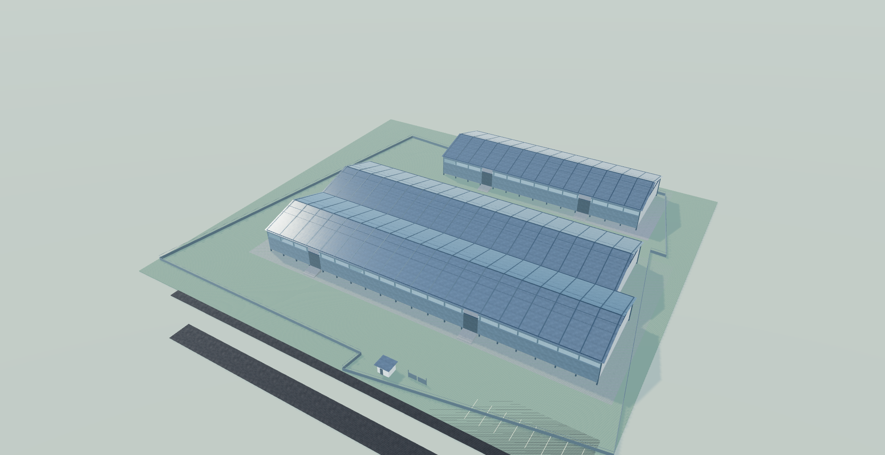

# Jetis seafood processing digital twin — Luna

Editable SketchUp and Three.js versions of the Jetis warehouse and site plan. Both use metres and share the source-derived footprint layout. The copied source is `source/input.dwg`; its SHA-256 is `ae5a91924b7a508a76e258c8141cf21c816b6378734217fa413e759cd0848072`.

[Open the interactive model](https://bambssquad.github.io/jetis-digital-twin-luna/) · [Download SketchUp 2023](https://bambssquad.github.io/jetis-digital-twin-luna/downloads/model.skp)

Implementation was completed by an actual `gpt-6-luna` High worker. Shared intake, independent source/browser review, release verification and publication were coordinated by Astra High. The separately implemented Astra version has its own repository.



## Source facts and assumptions

- The drawing labels four Stage 1 sheds: 30 × 36 m twice, 30 × 78 m and 30 × 84 m. Six-metre structural bays are dimensioned. Two Stage 2 labels divide an 84 m outline into two inferred 30 × 42 m modules.
- The north arrow (handle `165A6`) points along drawing +X; the adjacent `U` denotes Utara. Source origin is [2300, 1600, 0] m.
- Section notes identify grade ±0.00 m, floor 1 +1.00 m, eaves +9.00 m and ridge +13.50 m. Model Z has zero offset.
- All 446 extracted text annotations and 631 dimensions, with handles, are retained in `web/dist/assets/scene.json`.
- The DWG does not define door sizes or mechanisms. The twin assumes a 4.8 m roller shutter centered in a clear structural bay. Stage 1 row-A doors face north; row-B doors face south. This keeps the 6 m column grid clear. Wall finishes, glazing, paving, site furniture, guard post and open production interiors are visual assumptions where not detailed in the drawing.
- This is a visualization model, not structural approval or fabrication documentation.

See `analysis/spec.json` for source handles and the complete transform and assumption record. `STATE.md` records status and verification.

## Dependencies

- Python 3, NumPy and Matplotlib for extraction checks and drawing previews.
- AutoCAD with ObjectDBX for fresh DWG extraction.
- SketchUp 2023 and the local MCP bridge for native generation and audit.
- Node.js for collision-route verification; a WebGL browser for the viewer.

Three.js vendor files and texture maps ship locally. See `web/dist/assets/material-sources.json` and `web/dist/vendor/LICENSE-three.txt` for material and license records.

## Rebuild and check

Run in PowerShell from this directory:

```powershell
powershell.exe -NoProfile -ExecutionPolicy Bypass -File .\scripts\extract_dwg.ps1 -Dwg .\source\input.dwg -Output .\analysis\geometry.json
python .\scripts\inspect_drawing.py
python .\scripts\generate_scene.py
python .\scripts\project.py validate --project .
python .\scripts\verify_source_scene.py
node .\scripts\verify_navigation.mjs
python -m http.server 5186 --directory .\web\dist
```

Open `http://localhost:5186`. For native generation, start a verified blank SketchUp model, load `scripts/build_native.rb` through MCP, and call `DwgTwinBuild.run`. Reopen `outputs/model.skp` with a deferred SketchUp timer, then load `scripts/audit_native.rb` and call `DwgTwinAudit.run`. The final SKP is also available at `web/dist/downloads/model.skp`.

The extractor records the saved DWG state. Review unsupported or partial CAD entities before changing the model.
